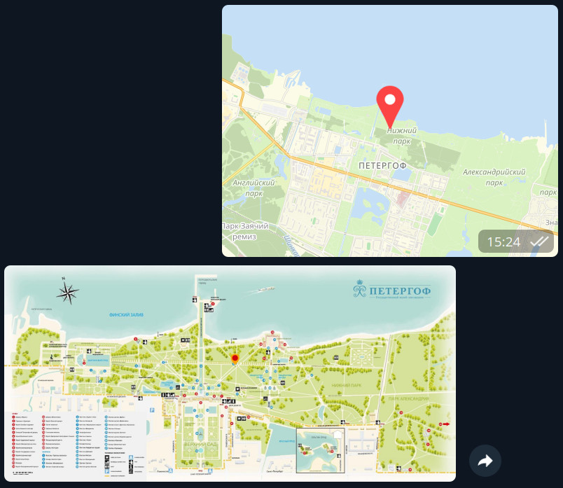
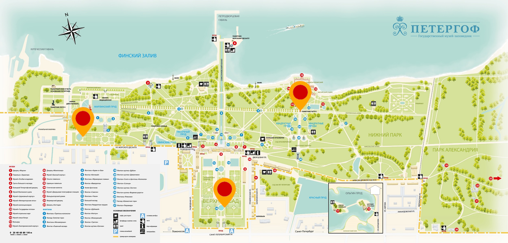

## Бот с интерактивной картой

### Описание

В данном репозитории представлен код телеграм-бота, которому можно отправить геопозицию, а он
вернет нарисованную карту, на которой отправленная геопозиция отмечена маркером.

### Примеры работы

В качестве примера можно написать телеграм-боту @interactive_mapper_bot.
Он работает с геопозициями на территории Петергофа.
Чтобы им воспользоваться, достаточно отправить интересующую геопозицию через мобильное приложение Телеграм.

Если геопозиция выходит за рамки фрагмента карты, бот сообщит о том, что не справился отметить точку на карте.



### Запуск сервера

Чтобы запустить бот локально, необходимо сначала установить все необходимые зависимости:

```
pip install -r requirements.txt
```

А затем запустить python-скрипт:

```
python main.py polling
```

### Принцип работы

В данной реализации используется предположение о том, что координатное пространство нарисованной карты может быть
получено из географических координат (широты и долготы) с помощью некоторого афинного преобразования.

Чтобы корректно транслировать геопозицию в координаты на карте, используется инициализация по трем точкам.
В файле `res/init.txt` перечислены три геопозиции и три соотвествтующие точки на карте. При запуске бота, по этим
данным вычисляется матрица афинного преобразования, которая ипользуется в дальнейшем для преобразования координат.

Используемые в данном примере точки приведены на картинке:

